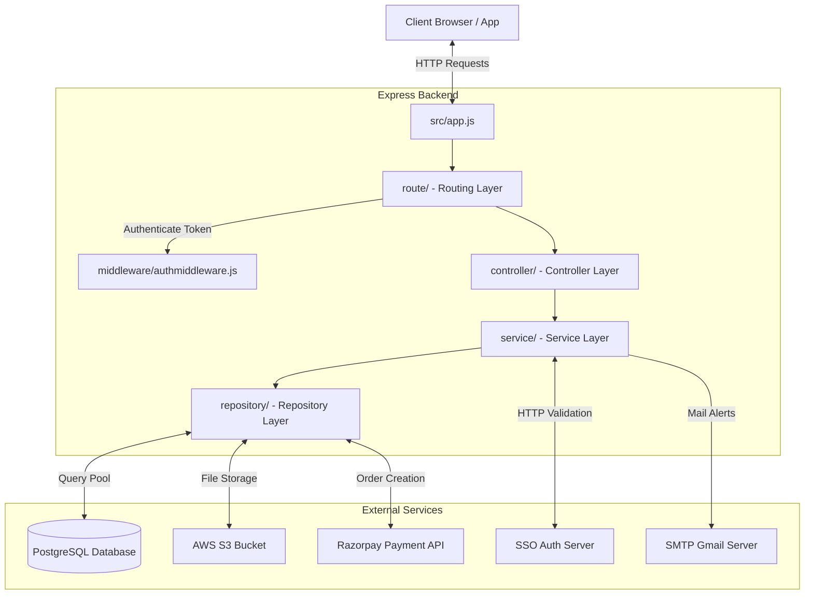
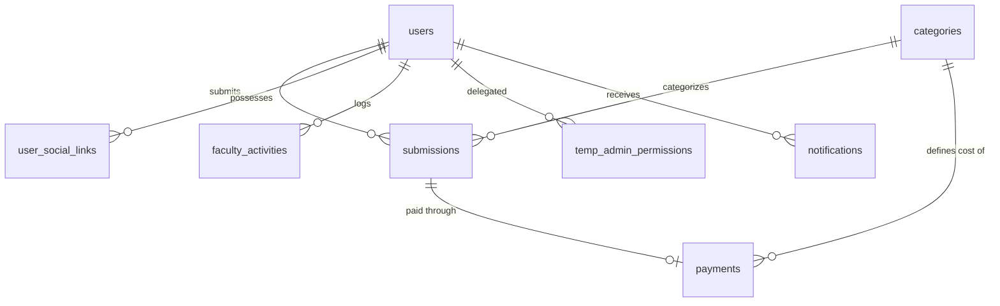
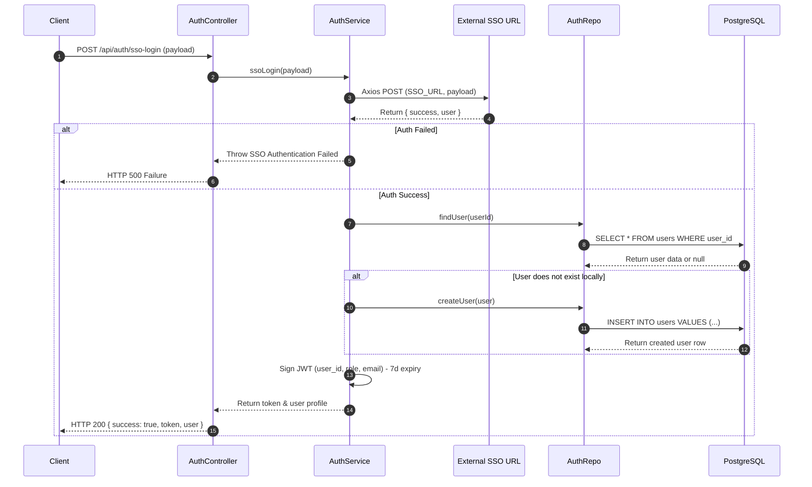
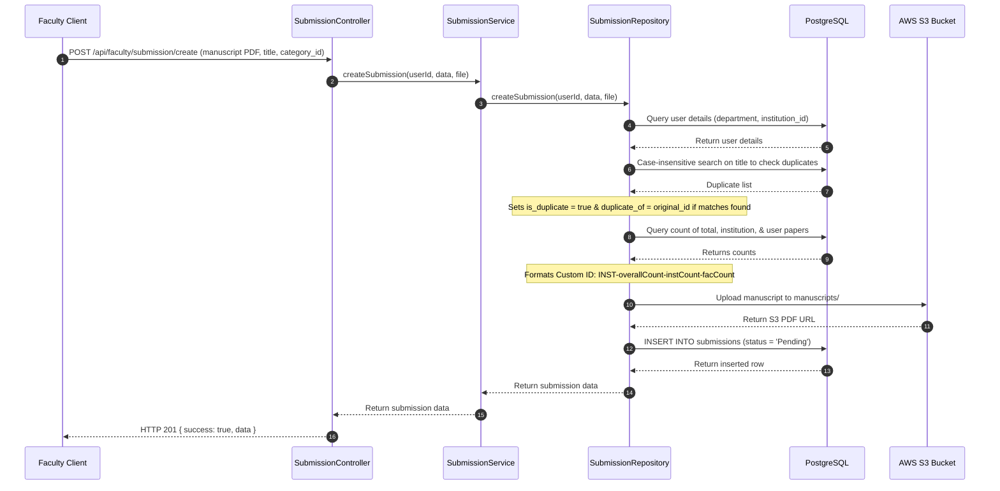
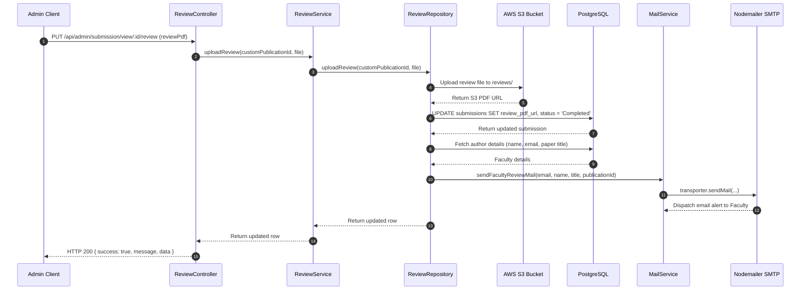
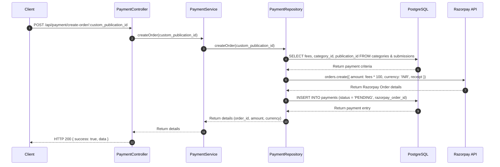

# Research Publication Management System (RPMS) - Backend

This repository houses the backend codebase for the Research Publication Management System (RPMS). The application manages faculty research submissions, coordinates reviews, generates formatted spreadsheet statistics for administrators, and processes payments via Razorpay.

---

## 1. System Architecture & Tech Stack

The system is constructed with Node.js and Express under a layered **Controller-Service-Repository** pattern:

*   **Server Initialization (`server.js`)**: Configures application environment variables and registers cron schedules.
*   **Express App Core (`src/app.js`)**: Configures middlewares (CORS, body parser) and connects the routing network.
*   **Routing System (`route/`)**: Intercepts HTTP requests and applies security layers (JWT verification).
*   **Controllers (`controller/`)**: Unpacks request payloads, delegates processing to services, and frames HTTP responses.
*   **Services (`service/`)**: Houses core business logic and triggers utility layers (SMTP mail).
*   **Repositories (`repository/`)**: Coordinates SQL transactions with PostgreSQL and operates cloud APIs (AWS S3 and Razorpay).
*   **Database Integration (`db.js`, `schema.SQL`)**: Connects to PostgreSQL using a connection pool.

---

## 2. Database Schema & Relationships

The database is built on PostgreSQL with the following core entities:

### Table Definitions
1.  **`users`**: Contains faculty and admin profiles. Includes boolean fields `admin` and `temp_admin` to configure roles.
2.  **`categories`**: Stores submission types (e.g., Journal, Conference) along with their respective validation fees.
3.  **`submissions`**: Tracks paper metadata, status (`Pending`, `Completed`), duplicate detection links, and S3 file locations.
4.  **`payments`**: Records Razorpay transaction parameters and status (`PENDING`, `SUCCESS`).
5.  **`temp_admin_permissions`**: Maps granular accessibility controls (e.g. `dashboard`, `submissions_queue`, `delete_manuscript`) to faculty members acting as temporary admins.
6.  **`social_media_master` & `user_social_links`**: Manages configured social profile platforms and users' specific links.
7.  **`notifications`**: Accumulates alert events for users.
8.  **`faculty_activities`**: Logs user login dates and submission counters.

---

## 3. Core Functional Workflows

### Workflow A: Single Sign-On (SSO) Authentication

### Workflow B: Manuscript Submission (Faculty Side)

### Workflow C: Review Upload & Completion (Admin Side)

### Workflow D: Payment Order Generation (Razorpay)

---

## 4. API Endpoints Dictionary

| HTTP Method | Route | Authentication | Purpose |
| :--- | :--- | :--- | :--- |
| **POST** | `/api/auth/sso-login` | None | Authenticates user against external SSO server and returns JWT. |
| **GET** | `/api/admin/profile` | JWT Auth | Returns details of the logged-in administrator. |
| **GET** | `/api/faculty/profile` | JWT Auth | Returns faculty details and enabled social media links. |
| **PUT** | `/api/faculty/social-links/profile/social-links` | JWT Auth | Rewrites social media URLs for the faculty member. |
| **GET** | `/api/admin/social-links` | None | Lists global social media platform definitions. |
| **POST** | `/api/admin/social-links` | None | Defines a new global social platform configuration. |
| **PUT** | `/api/admin/social-links/:id` | None | Enables/disables a global social media platform. |
| **DELETE**| `/api/admin/social-links:id` | None | Deletes a global social media configuration. |
| **POST** | `/api/admin/category-control/category` | JWT Auth | Adds a new submission category and fee tier. |
| **GET** | `/api/admin/category-control/categories` | JWT Auth | Lists all publication categories. |
| **PUT** | `/api/admin/category-control/category/:categoryId` | JWT Auth | Edits a category's name or processing fee. |
| **DELETE**| `/api/admin/category-control/category/:categoryId` | JWT Auth | Removes a category (only if unused by submissions). |
| **POST** | `/api/faculty/submission/create` | JWT Auth | Uploads manuscript, checks title duplicates, returns record. |
| **POST** | `/api/payment/create-order/:custom_publication_id` | JWT Auth | Generates a Razorpay transaction order. |
| **GET** | `/api/admin/submissionqueue` | JWT Auth | Lists all submissions sorted by uploaded date. |
| **GET** | `/api/admin/submission/view/:customPublicationId` | JWT Auth | Fetches granular details of a specific paper for evaluation. |
| **PUT** | `/api/admin/submission/view/:customPublicationId/review` | JWT Auth | Uploads feedback file and moves status to `Completed`. |
| **GET** | `/api/admin/tempadmin/faculties` | JWT Auth | Lists faculty candidates for temporary admin delegation. |
| **POST** | `/api/admin/tempadmin/grant-access` | JWT Auth | Converts faculty to temp admin and assigns access permissions. |
| **GET** | `/api/admin/tempadmin/permissions/:userId` | JWT Auth | Fetches delegated permission metrics. |
| **DELETE**| `/api/admin/tempadmin/revoke-access/:userId` | JWT Auth | Revokes temporary admin privileges. |
| **GET** | `/api/admin/dashboard` | JWT Auth | Renders dashboard summary counters and trend logs. |
| **GET** | `/api/admin/dashboard/export` | JWT Auth | Compiles an Excel workbook and returns download URL. |
| **GET** | `/api/admin/faculty-profiles` | JWT Auth | Catalogs faculty members alongside submission counts. |
| **GET** | `/api/admin/faculty-profile/:userId` | JWT Auth | Displays faculty profiles alongside individual paper tracks. |
| **GET** | `/api/my-publications` | JWT Auth | Retrieves user publications (Admin/Temp Admin sees all). |
| **GET** | `/api/my-publications/:customPublicationId` | JWT Auth | Displays individual publication data. |
| **GET** | `/api/notifications/admin/count` | JWT Auth | Counts unread notifications. |
| **GET** | `/api/notifications/faculty` | JWT Auth | Displays notifications stack sorted chronologically. |
| **PUT** | `/api/notifications/read/:notificationId` | JWT Auth | Sets notification state to read. |
| **GET** | `/test/test-mail` | None | Fires a debug email to verify SMTP network configuration. |

---

## 5. Background Tasks (Cron Job)

The application handles recurring compilation services:
*   **Daily Submission Report (`jobs/adminmailreport.js`)**: Executes daily at **6:00 PM** (`0 18 * * *`). It pulls a list of uploads from the previous 24 hours and emails an HTML summary directly to the admin (`process.env.ADMIN_EMAIL`).

---

## 6. Known Developer Findings & Critical Gaps

1.  **Missing Payment Hook Validation**: The payments system generates orders but does not provide API hooks or signature check logic to capture successful customer checkouts. Orders will remain in `PENDING` indefinitely.
2.  **Dormant Notification System**: The notification engine routes and database structures are complete, but in-app actions (e.g. file submissions, review uploads) never make calls to trigger the notifications.
3.  **Implicit Admin Guard Checks**: Routes nested under `/api/admin` rely on generic `authMiddleware` that verifies token presence but doesn't validate if `admin` or `temp_admin` flags are true on the user row, presenting a potential authorization issue.
